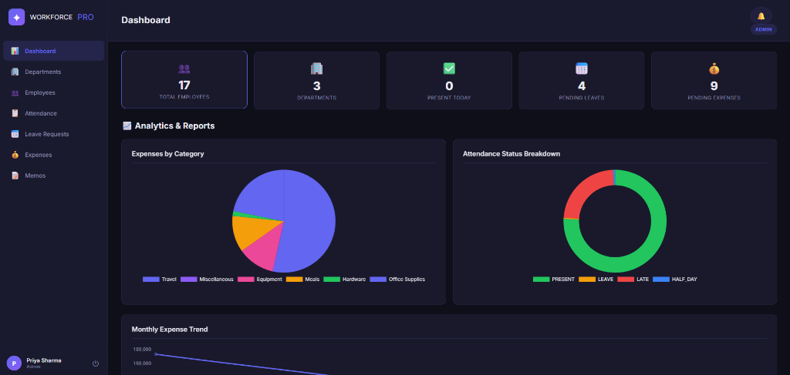
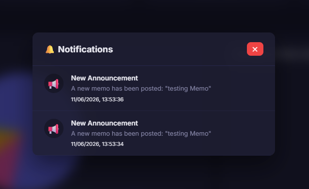
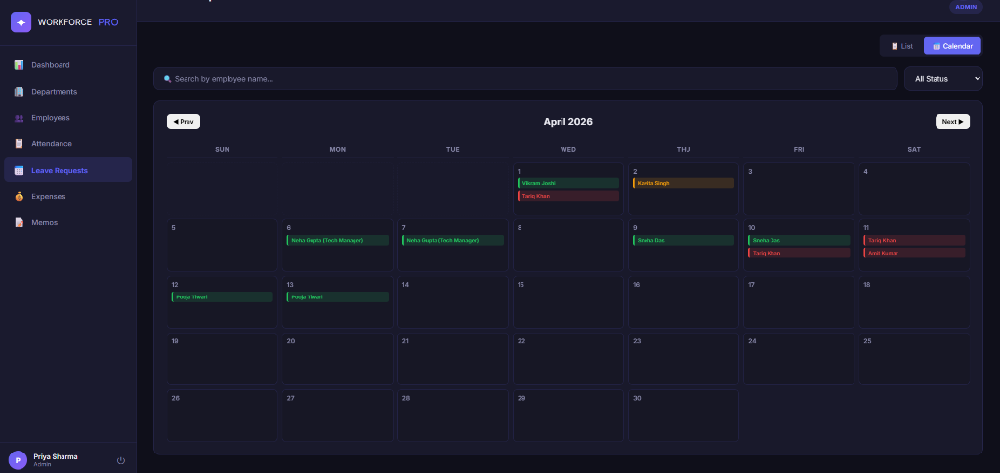

# 💻 WorkSync Pro — Frontend Client Application

This folder contains the frontend client application for **WorkSync Pro**, built as a Single Page Application (SPA) using **React**, **Vite**, **React Router**, and **Chart.js**, styled in a premium dark glassmorphic design system.



---

## 🚀 Technologies Used
- **Vite**: Ultra-fast next-generation frontend tool and bundler.
- **React (v19)**: Component-based UI library using hooks and functional states.
- **React Router Dom (v7)**: Client-side routing and page management.
- **Axios**: HTTP client configuration with interceptors for JWT injection.
- **Chart.js & react-chartjs-2**: High-performance SVG/Canvas charting engine.
- **Vanilla CSS**: Curated custom styling variables, slide drawers, and glassmorphic panels.

---

## 🎨 Frontend Features & Components

### 1. Unified Dashboard Analytics
Displays real-time corporate analytics for Administrators and Department Heads:
- **Stats Grid**: Frosted glass panels displaying Total Employees, Active Departments, Present Today count, and pending Leave/Expense queues.
- **Expenses by Category**: A Pie chart distributing company expenditures.
- **Attendance Breakdown**: A Doughnut chart tracking daily attendance records (Present, Late, Absent, Leave).
- **Monthly Trend Line**: Line chart visualising company expense budgets over time.

### 2. Real-Time Notification Bell & Overlay Panel
Eliminates manual page refreshes:
- **Notification Bell**: Mounted inside `Topbar.jsx`, it polls the server every 15 seconds to fetch the unread count.
- **Center Overlay modal**: Displays a list of alerts formatted with contextual icons (📅 for leaves, 💰 for expenses, 📢 for announcements).
- **Auto-Navigation Routing**: Clicking any alert immediately marks it read and routes the user to the specific page/drawer where the action occurred.



### 3. Interactive Leaves Calendar
Managing team attendance schedules at a glance:
- **Grid Layout**: A responsive monthly calendar showing team availability.
- **Status Indicator Badges**: Approved leaves (green), pending requests (yellow), and rejected items (red) span across their calendar dates.
- **Drawer Linkage**: Clicking on any leave badge on the calendar loads that request details into the approval drawer automatically.



### 4. Details Approvals Panel
- Interactive details drawer slides down above the tables on Departments, Employees, Leaves, and Expenses.
- Shows rich paragraphs of text, receipt image uploads, and metadata.
- Enables direct, inline Approve/Reject button clicks.

### 5. Shift Attendance & Exporters
- **Daily Timecard**: Check In / Check Out controls for staff.
- **Data Exporting**: Instant download of attendance logs and expense lists as standard CSV spreadsheets.

---

## 📂 Client Folder Structure
```
├── client/
│   ├── public/             # Static public assets
│   ├── screenshots/        # Markdown documentation screenshots
│   ├── src/
│   │   ├── components/
│   │   │   ├── ProtectedRoute.jsx  # Auth wrapper
│   │   │   ├── Sidebar.jsx         # Role-gated navigation sidebar
│   │   │   ├── Topbar.jsx          # Title header and notification bell
│   │   │   └── NotificationPanel.jsx # Centered glassmorphic alerts tray
│   │   ├── context/
│   │   │   └── AuthContext.jsx     # Handles user auth state & local storage JWT
│   │   ├── pages/
│   │   │   ├── Dashboard.jsx       # General metrics & charts
│   │   │   ├── Departments.jsx     # Clickable cards with member list drawer
│   │   │   ├── Employees.jsx       # Global directory & profile lookup cards
│   │   │   ├── Attendance.jsx      # Shift timecard & CSV records
│   │   │   ├── Leaves.jsx          # Leave requests list & monthly calendar grid
│   │   │   ├── Expenses.jsx        # Submit claims & review drawer
│   │   │   ├── Memos.jsx           # Announcement list board
│   │   │   └── Login.jsx           # Clean dark credentials page
│   │   ├── utils/
│   │   │   └── api.js              # Axios dynamic connection instance
│   │   ├── App.css                 # Dark glassmorphic design stylesheet
│   │   ├── App.jsx                 # Routes declarations
│   │   └── main.jsx                # React bootstrapper
│   ├── index.html                  # HTML entry point
│   ├── package.json
│   ├── vercel.json                 # Vercel static router configurations
│   └── vite.config.js              # Vite React configuration setups
```

---

## 🛠️ Local Installation & Development

1. Navigate to this directory in your terminal:
   ```bash
   cd client
   ```
2. Install package dependencies:
   ```bash
   npm install
   ```
3. Run the development server (Hot Module Replacement active):
   ```bash
   npm run dev
   ```
   *The client application will run at `http://localhost:5173`.*

4. Build the static production bundle:
   ```bash
   npm run build
   ```
   *The built assets will compile to the `client/dist` directory.*

---

## ⚡ Deployment on Vercel

WorkSync Pro is configured for instant hosting on Vercel:

### 1. vercel.json Routing Fix
Vite handles routing client-side via React Router. The frontend directory includes a custom **`vercel.json`** file:
```json
{
  "cleanUrls": true,
  "rewrites": [
    { "source": "/(.*)", "destination": "/index.html" }
  ]
}
```
*This rewrites all incoming edge server requests back to `/index.html` to prevent "404 Not Found" errors when users refresh deep URLs like `/leaves`.*

### 2. Vercel Settings:
1. **Framework Preset**: `Vite` (detected automatically)
2. **Root Directory**: `client` (or set the Vercel project's root directly to this folder)
3. **Build Command**: `npm run build`
4. **Output Directory**: `dist`
5. **Environment Variable (VITE_API_URL)**:
   Add your backend Render URL as a variable:
   - **Key**: `VITE_API_URL`
   - **Value**: `https://b2b-workbeta-app-backend.onrender.com/api` *(make sure to append the `/api` route suffix!)*
